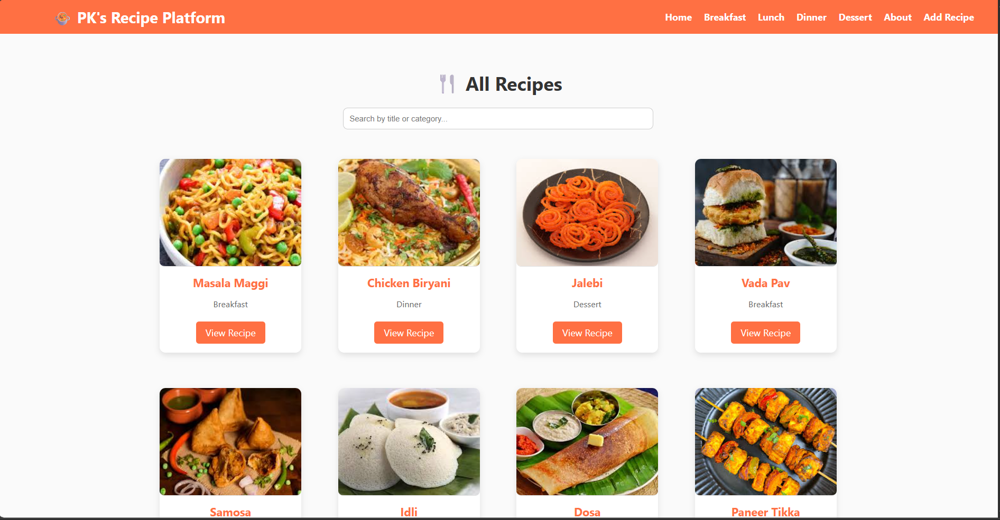
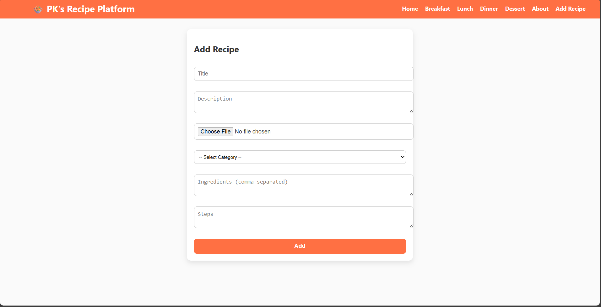
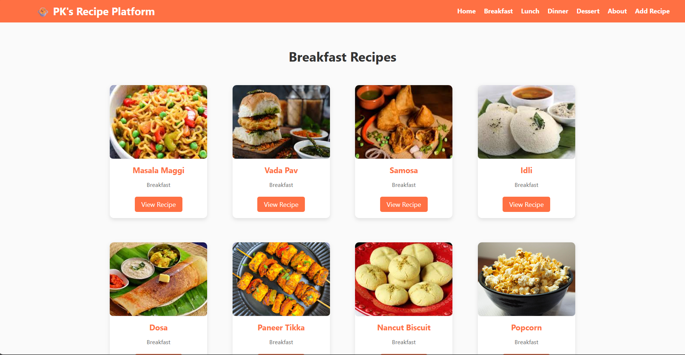
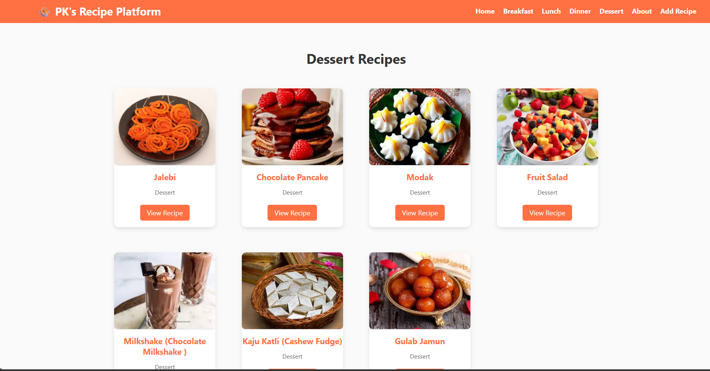
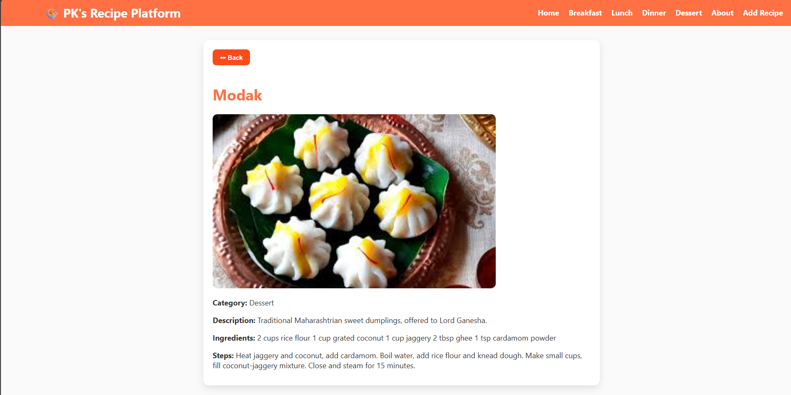

# Recipe Platform 🍲

A full-stack recipe-sharing platform where users can add, explore, and manage recipes.

## 🔹 Features
- Add, edit, and delete recipes
- Search recipes by category
- User-friendly UI with React
- Backend powered by Spring Boot + MySQL

## 🔹 Tech Stack
- React.js
- Spring Boot
- MySQL
- REST API

## 🔹 Screenshots

### 🏠 Home Page

### ➕ Add Recipe

### 🔑 Breakfast Page

### 🔑 Dessert Page

### 🔑 View Full Recipe Page

